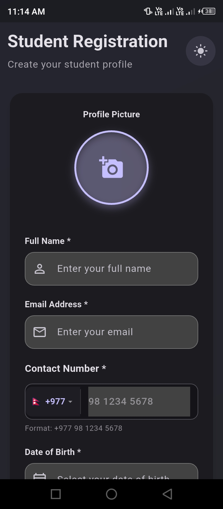
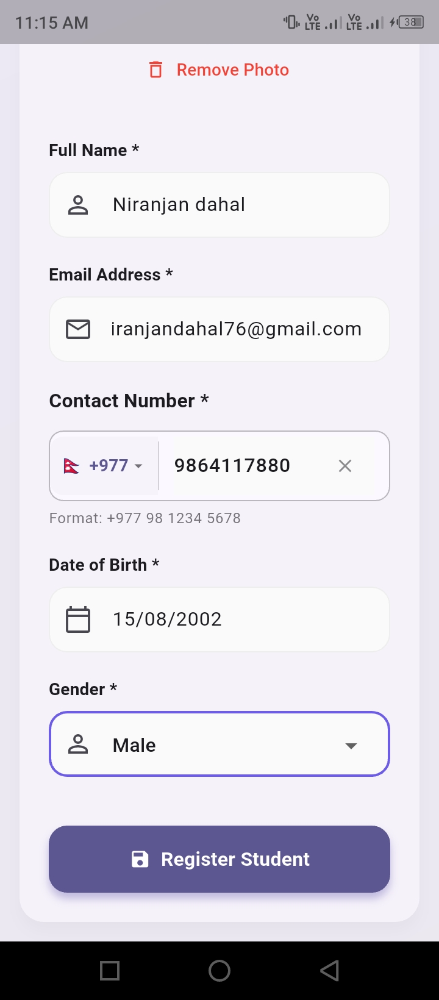
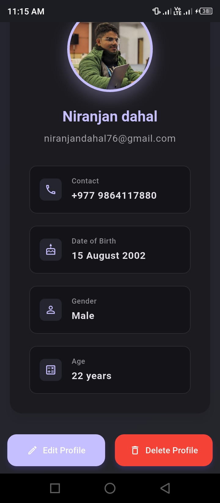
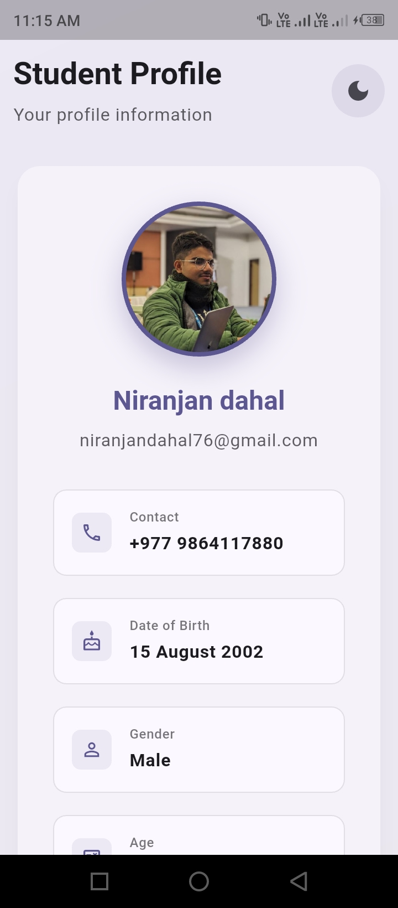
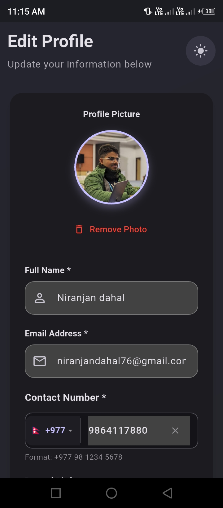
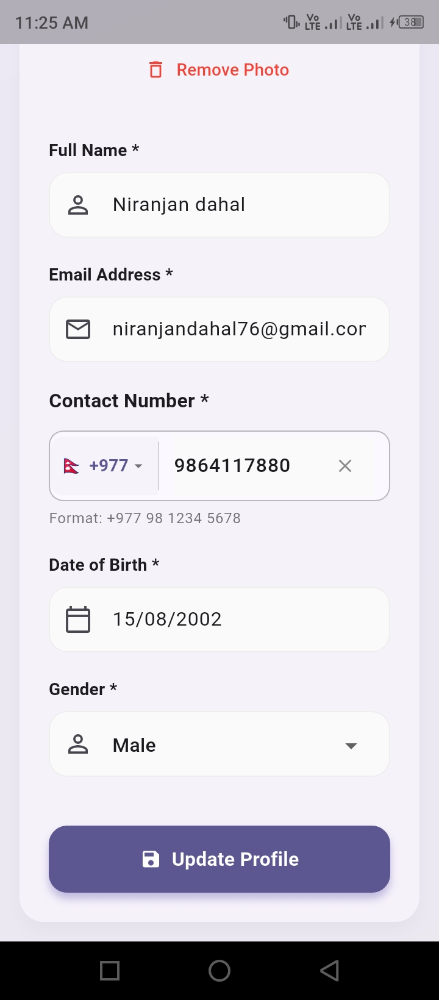

#  Student Profile App

> This application is built with Flutter for managing student profiles with validation, beautiful UI, and persistent storage.

## Download APK

[](https://github.com/niranjandahalofficial/studentprofileapp/releases/download/versrion1.0/app-release.apk)

*Click the badge above to download the latest APK from our releases page.*

---

## 📱 App Demo Video

> **See the app in action!** Complete walkthrough of all features with smooth animations and interactions.

<div align="center">

### 🎬 Full App Walkthrough

<video width="300" height="600" controls autoplay muted loop>
  <source src="./samplevideo.mp4" type="video/mp4">
  <p>Your browser doesn't support HTML5 video. <a href="./samplevideo.mp4">Download the video</a> instead.</p>
</video>

</div>


---

## App Screenshots

### Registration Screen
  
   

   

### Profile Display Screen  
 
   
   

### Edit student detail

  

 


##  Features

###  Core Functionality
- **Student Registration**: Complete profile creation with validation
- **Profile Management**: View, edit, and delete student profiles
- **Data Persistence**: Local storage using SharedPreferences
- **Theme Support**: Light/Dark theme with system preference detection


### Animation On Screen Transistion(fade and slide in)
implemented fade and slide in animation between screen transistion using animationcontroller.


### 📋 Form Fields & Validation
- **Full Name**: Minimum 2 characters with real-time validation
- **Email**: RFC-compliant email validation with pattern matching
- **Phone Number**: International support with country code selection
  - 🇳🇵 Nepal (+977) - Default country with 10-digit validation
  - 13+ Countries supported (US, UK, Canada, Australia, etc.)(can be added more)
  - Real-time validation based on country-specific rules
- **Date of Birth**: Date picker with age constraints (5-100 years)
- **Gender**: Dropdown selection (Male, Female, Other)
- **Profile Picture**: Camera/Gallery selection with image picker


### 🎨 UI/UX Excellence
- **Material Design 3**: Modern, clean interface following Google's design guidelines
- **Smooth Animations**: Fade and slide transitions for better user experience
- **Responsive Layout**: Optimized for various screen sizes
- **Error Handling**: User-friendly error messages with inline validation
- **Loading States**: Progress indicators during async operations

### 🔧 Technical Features
- **State Management**: Provider pattern for reactive UI updates
- **Form Validation**: Comprehensive client-side validation
- **Country Code System**: Advanced phone validation with country-specific rules
- **Image Handling**: Profile picture support with local storage
- **Data Serialization**: JSON-based data storage and retrieval

---

##  Implementation Details

### Architecture Pattern
```
├── 📁 models/          # Data models (Student)
├── 📁 providers/       # State management (StudentProvider, ThemeProvider)
├── 📁 screens/         # UI screens (Registration, Profile Display)
├── 📁 services/        # Data services (StorageService)
├── 📁 utils/           # Utilities (Validators, AppTheme)
└── 📁 widgets/         # Reusable components (CustomTextField, PhoneNumberField)
```

### Key Components

#### 📱 Phone Number Field
- Custom widget with integrated country code dropdown
- Real-time validation based on selected country
- Support for 13+ countries with specific formatting rules
- Auto-clear functionality when switching incompatible countries

#### 🎨 Theme System
- Dynamic theme switching between light and dark modes
- Persistent theme preference storage
- Material Design 3 color schemes
- System theme detection

#### 💾 Data Persistence
- SharedPreferences for local data storage
- JSON serialization for complex objects
- Automatic data loading on app startup
- Secure data deletion functionality

#### ✅ Validation System
- Real-time form validation
- Country-specific phone number validation
- Email pattern matching
- Age constraints for date of birth
- Custom error messages

---

##  Scalability 

### Immediate Improvements
- **Multi-language Support**: i18n implementation for global reach
- **Cloud Sync**: Firebase integration for data backup and sync
- **Batch Operations**: Import/export multiple student profiles
- **Advanced Search**: Filter and search functionality
- **Profile Analytics**: Usage statistics and insights

### Medium-term Enhancements
- **Multi-user Support**: Teacher/admin accounts with role-based access
- **Student Groups**: Class/section management system
- **Attendance Tracking**: Check-in/check-out functionality
- **Document Management**: Attach and manage student documents
- **Notification System**: Reminders and alerts

### Long-term Vision
- **Institution Management**: Multi-school/college support
- **Grade Management**: Academic performance tracking
- **Parent Portal**: Parent access to student information
- **Integration APIs**: Connect with existing school management systems
- **AI Features**: Smart data insights and recommendations
- **Offline-first Architecture**: Complete offline functionality with sync

### Technical Scaling
- **Database Migration**: SQLite → Firebase/PostgreSQL for better performance
- **Microservices**: Break down into smaller, manageable services
- **API Development**: RESTful APIs for web dashboard integration
- **Testing Suite**: Unit, integration, and widget testing
- **CI/CD Pipeline**: Automated building, testing, and deployment
- **Performance Optimization**: Image compression, lazy loading, caching

---

## 🛠️ Development Setup

### Prerequisites
- Flutter SDK (3.0+)
- Dart SDK (3.0+)
- Android Studio / VS Code
- Android SDK / Xcode (for iOS)

### Getting Started
```bash
# Clone the repository
git clone https://github.com/yourusername/students_profile_app.git

# Navigate to project directory
cd students_profile_app

# Get dependencies
flutter pub get

# Run the app
flutter run
```

### Dependencies
- `provider` - State management
- `shared_preferences` - Local storage
- `image_picker` - Profile picture selection
- `intl` - Date formatting and internationalization

---

## 🤝 Contributing

We welcome contributions! Please see our [Contributing Guidelines](CONTRIBUTING.md) for details.

### Development Guidelines
- Follow Flutter/Dart style guide
- Write comprehensive tests
- Update documentation
- Use meaningful commit messages

---

## 📄 License

This project is licensed under the MIT License - see the [LICENSE](LICENSE) file for details.

---

## 👨‍💻 Author

**Your Name**
- GitHub: [@niranjandahal](https://github.com/niranjandahal)
- Email: niranjandahal76@gmail.com

---

<div align="center">
  <p>Made with ❤️ using Flutter</p>
  <p>⭐ Star this repo if you found it helpful!</p>
</div>