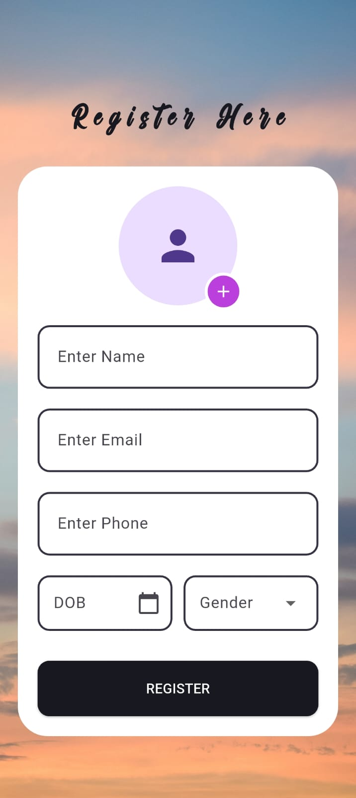
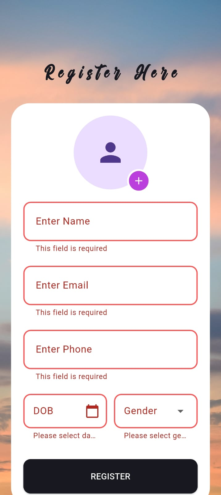
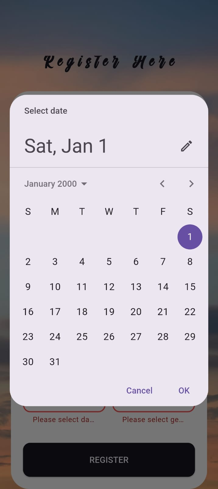
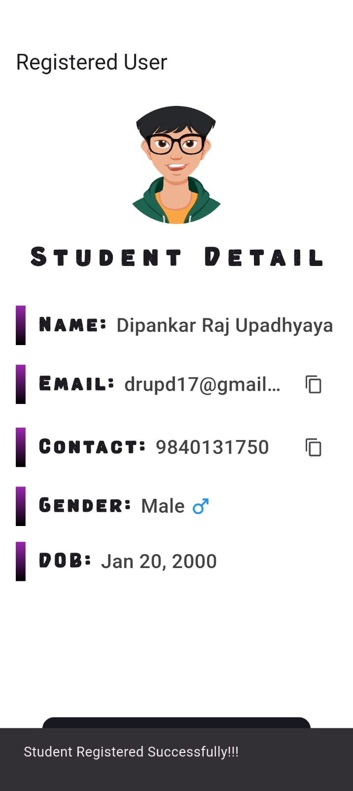
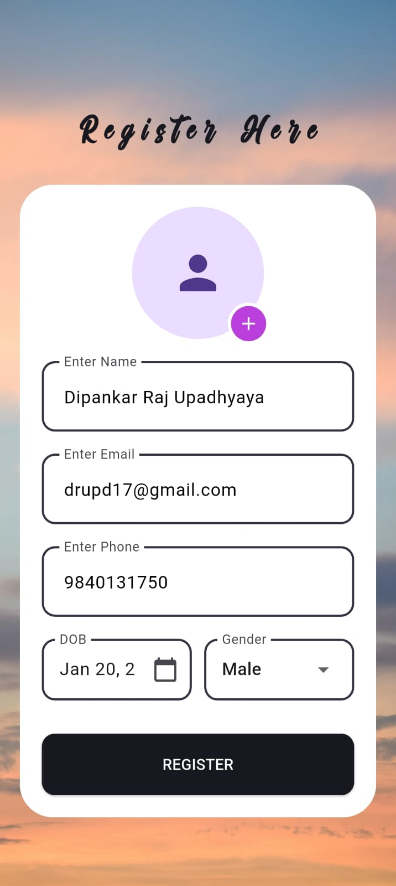
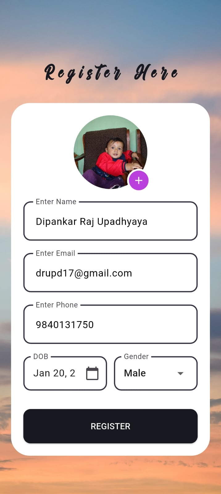
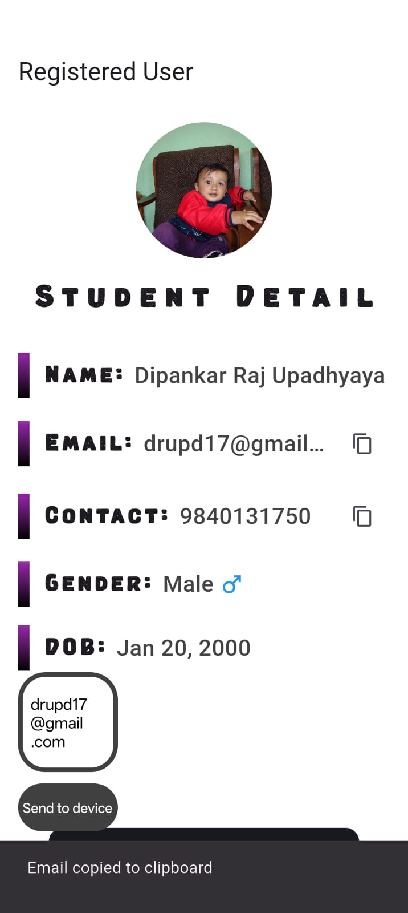

# Flutter Student Registration App

A comprehensive Flutter application developed for an internship task, featuring student registration and profile management with clean UI and robust state management.

## 📸 Screenshots

### Registration Screen
| Empty Form | Form Validation | Date Picker |
|------------|----------------|-------------|
|  |  |  |

### Profile Display Screen
| Profile View | Edit Mode |
|--------------|-----------|
|  |  

### Image Selection & Features
| Image Picker | Copy Feature | 
|--------------|--------------|
|  |  | 

## 🚀 Getting Started

To run this application on your local device, follow these steps:

1. **Clone the repository:**
   ```bash
   git clone https://github.com/dipankarupd/Flutter-Task
   ```

2. **Navigate to the Flutter app directory:**
   ```bash
   cd app
   ```

3. **Clean and install dependencies:**
   ```bash
   flutter clean
   flutter pub get
   ```

4. **Run the application:**
   - Open `main.dart` and run the app on your preferred device (emulator or physical device)

## ✨ Key Features

### 📋 Screen 1: Student Registration
- **Comprehensive Input Fields:**
  - Full Name with character validation
  - Email with proper format validation
  - Contact Number with 10-digit validation
  - Date of Birth with interactive date picker
  - Gender selection (Male, Female, Other) via dropdown
  - Profile Picture upload from device gallery

- **Smart Validations:**
  - Required field validation for all inputs(excluding DP)
  - Email format validation using regex patterns
  - Contact number validation (Exact 10 digits)
  - Name validation (letters and spaces only, minimum 2 characters)
  - Real-time form validation with error highlighting

- **User Experience:**
  - Clean, responsive UI design
  - Success Scaffold message upon registration
  - Smooth navigation to profile display

### 👤 Screen 2: Profile Display
- **Structured Data Presentation:**
  - Professional profile layout with avatar display
  - Clean typography with custom fonts
  - Gender-specific default avatars when no profile picture is provided
  - Formatted date display using `intl` package

- **Interactive Features:**
  - **Edit Profile:** Returns to registration form with all data pre-populated
  - **Copy Functionality:** One-tap copy for email and contact number
  - **Image Display:** Shows selected profile picture or gender-based default avatar

### 🎨 UI/UX Excellence
- **Responsive Design:** Optimized for both mobile and tablet devices
- **Custom Fonts:** Enhanced visual appeal with 'Awesome' and 'Vintaface' fonts
- **Clean Architecture:** Consistent design patterns throughout the app
- **Smooth Animations:** Seamless transitions between screens

## 🏗️ Technical Architecture

### State Management
- **Flutter BLoC Pattern:** Complete state management using `flutter_bloc`
- **Event-Driven Architecture:** Clean separation of business logic
- **Local State Handling:** No external databases - all data managed in-app state

### Validation System
- **Comprehensive Form Validation:** Real-time input validation
- **Custom Validator Logic:** Tailored validation rules for each field type
- **User-Friendly Error Messages:** Clear feedback for validation failures

## 📦 Dependencies

| Package | Purpose | Usage |
|---------|---------|-------|
| `flutter_bloc` | State Management | Managing app state, events, and business logic |
| `image_picker` | Image Selection | Picking profile pictures from device gallery |
| `intl` | Date Formatting | Formatting dates for better user experience |

## 🎨 Custom Assets

### Fonts
- **Awesome:** Used for main headings and titles
- **Vintaface:** Used for secondary text and labels

## 🔧 Advanced Features Implemented

### Form Validation
```dart
// Comprehensive validation including:
- Email regex validation
- Phone number format checking
- Name character validation
- Required field validation
```

### Image Handling
- Gallery image selection
- Gender-based default avatars
- Profile picture persistence across edit sessions


### User Interaction
- **Copy to Clipboard:** Email and contact number copying functionality
- **Date Selection:** Interactive date picker with proper formatting
- **Form Pre-population:** Edit mode automatically fills all form fields
- **Error Handling:** Graceful error handling with user feedback

## 🎯 Project Requirements Fulfilled

✅ **Complete Registration Form** with all specified fields  
✅ **Form Validation** with proper error handling  
✅ **Local State Management** using BLoC pattern  
✅ **Profile Display Screen** with structured layout  
✅ **Edit Functionality** with pre-filled data  
✅ **Responsive UI Design** for multiple screen sizes  
✅ **Clean Code Architecture** with proper separation of concerns  
✅ **Professional UI/UX** with custom fonts and styling  


## 📱 Compatibility

- **Platforms:** Android and iOS
- **Screen Sizes:** Optimized for phones and tablets

---

**Developed by:** Dipankar Raj Upadhyaya  
**Project Type:** Internship Task    

*This project demonstrates proficiency in Flutter development, state management, form handling, and creating production-ready mobile applications.*