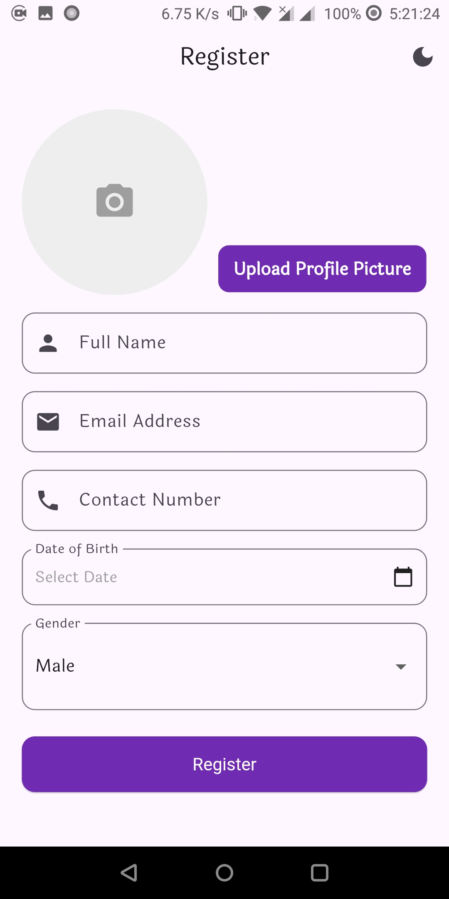
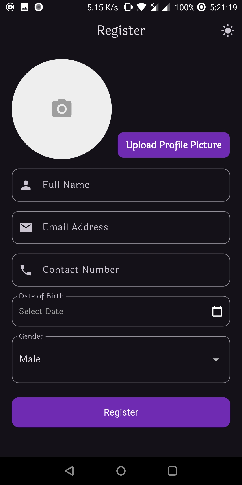
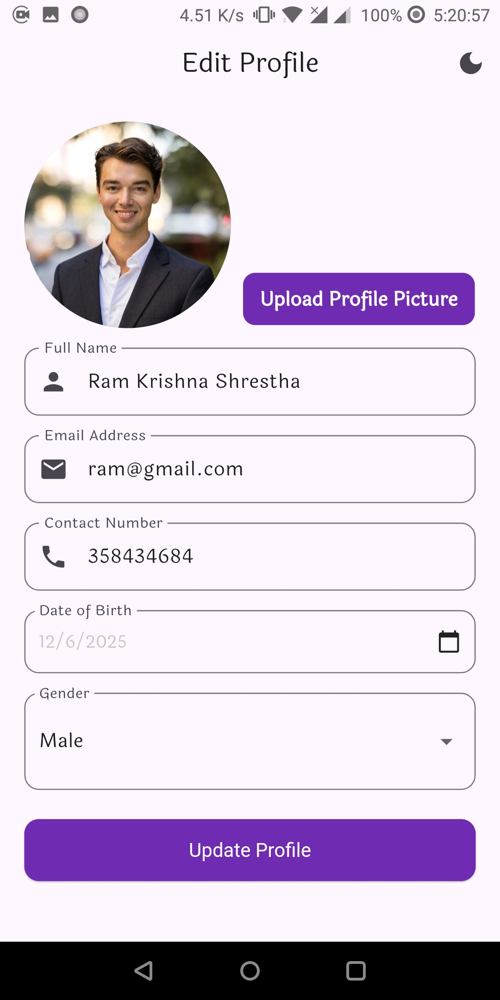
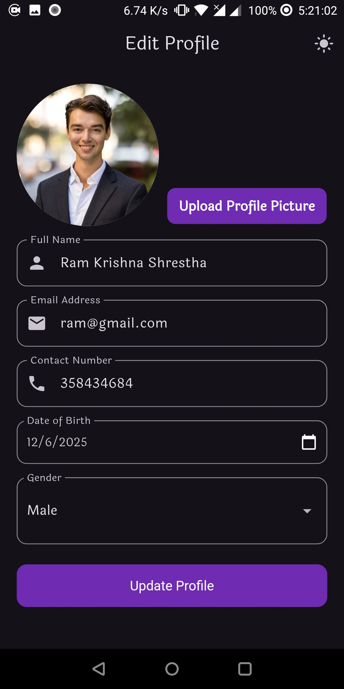
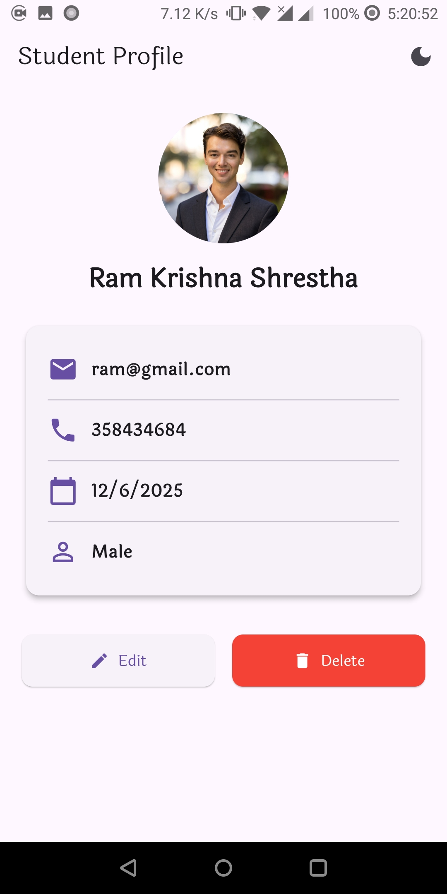
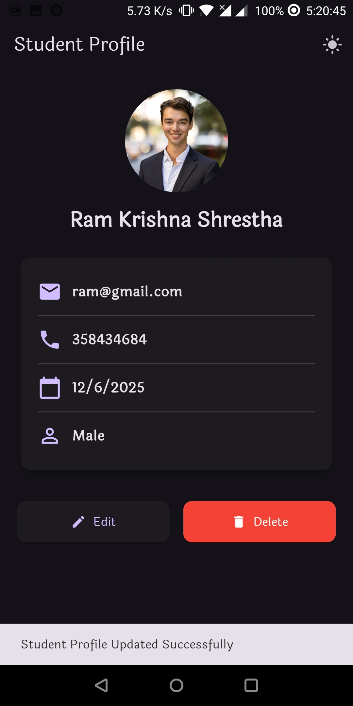
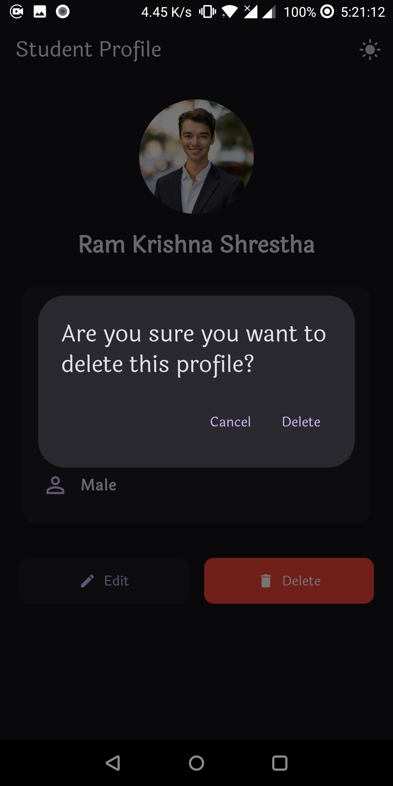

## APP STRUCTURE
* Student model is added
* Provider is used to save the state of the Student model
* The student model is checked first to determine whether to update or save the data.
* The provider is used to toggle the variable holding value of the app state, which determines whether to turn dark mode on or off.
* After saving the data, while editing, it will prefill data from the provider.
* Deleting the data will show a user dialog box, taking the user to registration if the user deletes the data.

## APP SCREENSHOTS

